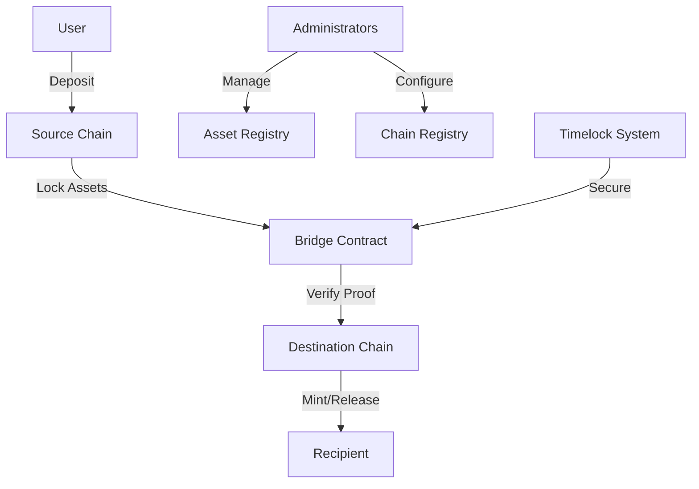

# LoopSync Asset Bridge

A secure cross-chain asset bridge enabling seamless asset synchronization between multiple blockchain networks via the Stacks blockchain.

## Overview

LoopSync provides a secure and efficient mechanism for transferring tokenized assets across different blockchain networks. The system allows users to:

- Lock assets on one chain and mint equivalent representations on another
- Maintain consistent state and total supply across networks
- Preserve asset properties and ownership throughout transfers
- Utilize cryptographic proofs for secure cross-chain verification

### Key Features

- Multi-asset support (FTs, NFTs, STX)
- Timelocked transfers for large amounts
- Daily transfer limits
- Cryptographic proof verification
- Administrator-controlled asset and chain registry
- Comprehensive transaction history
- Pausable operations for emergency situations

## Architecture

The LoopSync bridge employs a lock-and-mint mechanism for cross-chain transfers:



### Core Components

1. **Bridge Contract**: Central hub managing asset transfers and verification
2. **Asset Registry**: Tracks supported assets and their configuration
3. **Chain Registry**: Manages supported blockchain networks
4. **Timelock System**: Secures large transfers with waiting periods
5. **Proof Verification**: Validates cross-chain transactions

## Contract Documentation

### loopsync-bridge.clar

The main bridge contract handling all cross-chain operations.

#### Key Functions

**Public Functions:**
- `deposit-to-external-chain`: Lock assets for transfer to external chain
- `process-external-deposit`: Release assets from external chain deposits
- `release-timelocked-deposit`: Complete timelocked transfers
- `cancel-timelocked-deposit`: Cancel pending timelocked transfers

**Administrative Functions:**
- `set-supported-asset`: Configure supported assets
- `set-supported-chain`: Configure supported chains
- `set-administrator`: Manage admin access
- `set-paused`: Emergency pause mechanism
- `transfer-ownership`: Transfer contract control

## Getting Started

### Prerequisites

- Clarinet
- Stacks wallet
- Access to supported blockchain networks

### Usage Examples

1. Depositing assets to external chain:
```clarity
(contract-call? .loopsync-bridge deposit-to-external-chain 
    "USDA" 
    u1000000 
    "ETH" 
    "0x1234...")
```

2. Processing external deposits:
```clarity
(contract-call? .loopsync-bridge process-external-deposit
    "proof-hash"
    "ETH"
    "USDA"
    u1000000
    "0x1234..."
    tx-sender)
```

## Function Reference

### Asset Management

```clarity
(set-supported-asset asset-id asset-type asset-contract conversion-rate daily-limit min-amount max-amount timelock-threshold timelock-blocks is-active)
```

### Bridge Operations

```clarity
(deposit-to-external-chain asset-id amount destination-chain destination-address)
(process-external-deposit proof-data chain-id asset-id amount source-address recipient)
```

### Timelock Management

```clarity
(release-timelocked-deposit tx-id)
(cancel-timelocked-deposit tx-id)
```

## Development

### Testing

1. Clone the repository
2. Install Clarinet
3. Run tests:
```bash
clarinet test
```

### Local Development

1. Start Clarinet console:
```bash
clarinet console
```

2. Deploy contracts:
```clarity
(contract-call? .loopsync-bridge ...)
```

## Security Considerations

### Limitations

- Cryptographic proof verification depends on external chain's consensus
- Daily transfer limits may affect large-volume transfers
- Timelocks add waiting periods for significant transfers

### Best Practices

- Always verify recipient addresses before transfers
- Wait for required confirmations on external chains
- Monitor daily limits before initiating large transfers
- Use timelocked transfers for additional security on large amounts

### Risk Mitigation

- Contract pausability for emergency response
- Administrative controls for asset/chain configuration
- Proof verification to prevent replay attacks
- Transaction history for audit trails